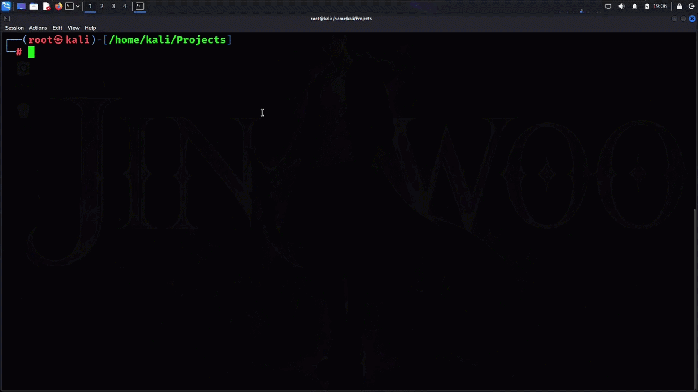

# 🛡️ Shadow Hack



## 📌 About

> **Security notice:** This source contains functionality that can collect browser/device information and attempt to access a user's camera, microphone, location, contacts, and selected media, then transmit data to a Flask server. It also supports public tunnel services. Do not deploy it against real people or devices.

## Overview

The Python application combines a Flask web server with a terminal-based configuration menu. Its source includes themed web pages, configurable browser data collection routines, local file storage, JSON event logging, and optional tunnel-process management.

This README documents the code at a high level for review and controlled defensive analysis. It is not deployment guidance.

## Components

- **Flask server:** Serves a page and accepts JSON submissions at `/upload`.
- **Web interface:** Uses HTML, CSS, and JavaScript embedded in the Python source.
- **Collection routines:** Source includes routines involving camera, video/audio, geolocation, contacts, selected gallery files, and device/browser metadata.
- **Local storage:** Creates a `LOOT` directory and writes event records to `victims.json`.
- **Tunnel integrations:** Contains code paths for Cloudflare Tunnel, ngrok, and nport.
- **Terminal menu:** Offers template, mode, duration, tunnel, and output-folder configuration.

## Technology

- Python
- Flask
- HTML, CSS, JavaScript
- Browser MediaDevices, Geolocation, Contacts, and File APIs
- Optional external tunnel utilities

## Source Layout

The application is currently provided as a single Python file. Major areas include:

| Area | Purpose |
|---|---|
| Configuration | Port, storage paths, duration, tunnel selection |
| Templates | Web page content and presentation |
| Browser scripts | Client-side collection routines |
| Flask routes | Page serving and upload handling |
| Tunnel helpers | External tunnel process management |
| Menu functions | Interactive terminal configuration |
| Storage/logging | Local files and JSON event history |

## Important Security Findings

The source should be treated as **high risk**:

- It presents misleading scenarios (for example, giveaways, age checks, and tracking claims) before requesting personal information or browser permissions.
- It can transmit collected media and personal/device data to the server.
- It creates public tunnel URLs, potentially exposing the service beyond the local machine.
- It writes collected data to disk without an evident encryption or retention policy.
- The upload route does not show authentication, authorization, CSRF protection, or robust input-size limits.
- Some displayed claims (such as exact phone tracking or dark-web scanning) are not implemented by the shown browser routines.

## Safe Handling

1. Do not run this against other people, public devices, or production systems.
2. If reviewing behavior, use an isolated, offline lab with synthetic data and no public tunnel.
3. Do not grant browser permissions to an untrusted page.
4. Keep any test artifacts access-restricted and delete them after analysis.
5. For a legitimate training demo, replace collection and upload behavior with a local-only mock that uses synthetic data and clear, informed consent.


## 📥 Installation

```bash
git clone https://github.com/Saksham122004/shadow_hack.git

cd shadow_hack

pip install -r requirements.txt
```

## 🚀 Usage

```bash
python shadow_hack.py
```

Open your browser:

```text
http://127.0.0.1:8080
```

## 📂 Project Structure

```text
shadow_hack/
│
├── image/
│   └── demo.gif
│
├── shadow_hack.py
├── requirements.txt
└── README.md
```

## ⚠️ Disclaimer

This project is intended for educational purposes and authorized security research.
Use only in environments where you have explicit permission. Do not collect personal information, access devices, or record audio/video without informed consent.
The author is not responsible for misuse.

## 👨‍💻 Author

**Saksham Katiyar**
GitHub: [@Saksham122004](https://github.com/Saksham122004)
